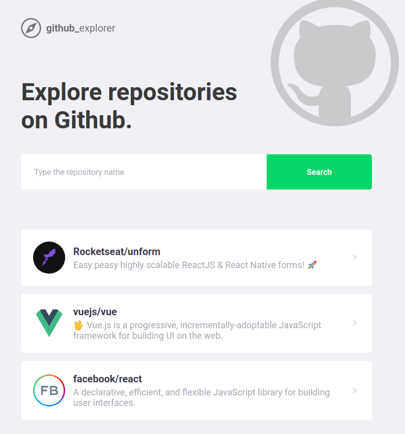
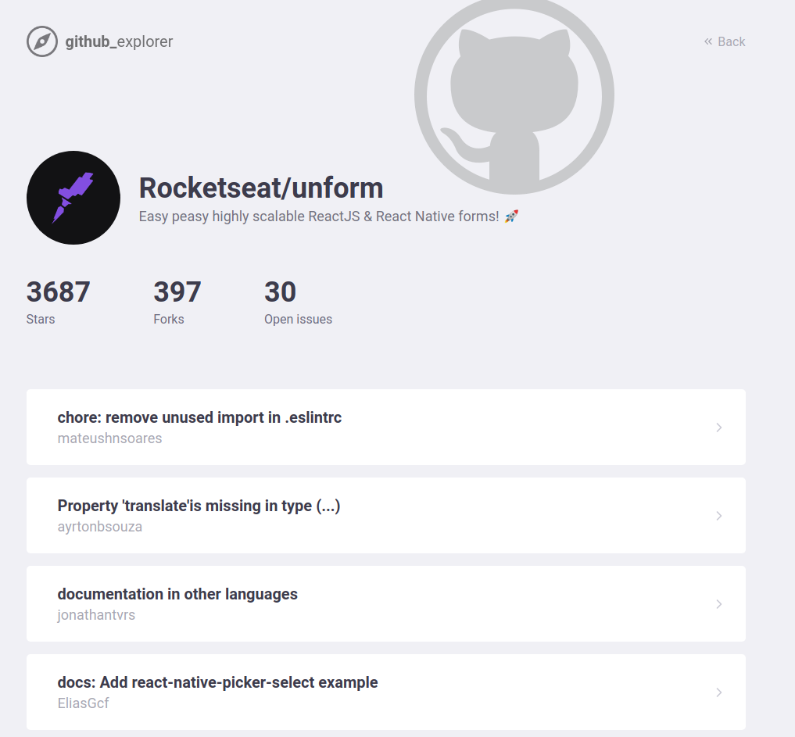

# Github Explorer

Project developed copying the instructor coding during the Rocketseat Bootcamp Course.

## What I learned or did in this project?
  - react-router-dom: used to create the routes.
  - styled-components: isolate css style as a react component.
  - polished: component to manipulate colors.
  - react-icons: library with many icons.
  - how initiate a react variable with useState component.
  - how persist a variable in localStorage using useEffect component.
  - define axios response type with TypeScript.
  - access props inside Styled component.
  - how two independent request can be made at the same time and how use interfaces to represent API responses.
  - use noreferrer and noopener by security issue, when a html ancor open in another tab.

## See the screenshots

