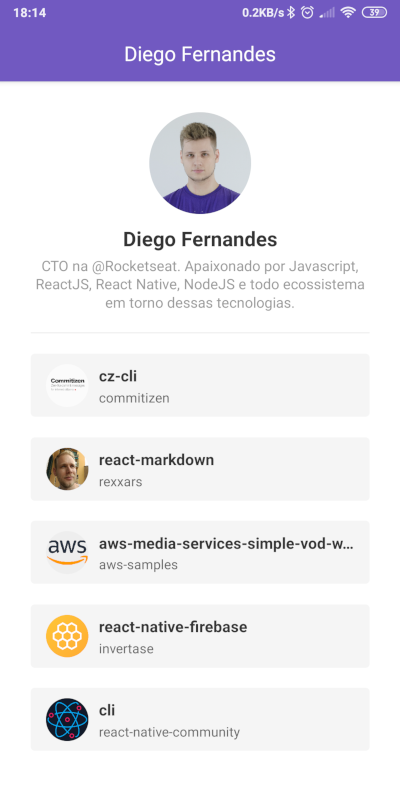

# React Native Git Repository

Project developed copying the instructor coding during the Rocketseat Bootcamp Course.

## What I learned in this project?

- StackNavigator
- Navigation's props
- Function component
- Class component
- Basic Hooks like setState
- Reactotron tool

## See the screenshots

